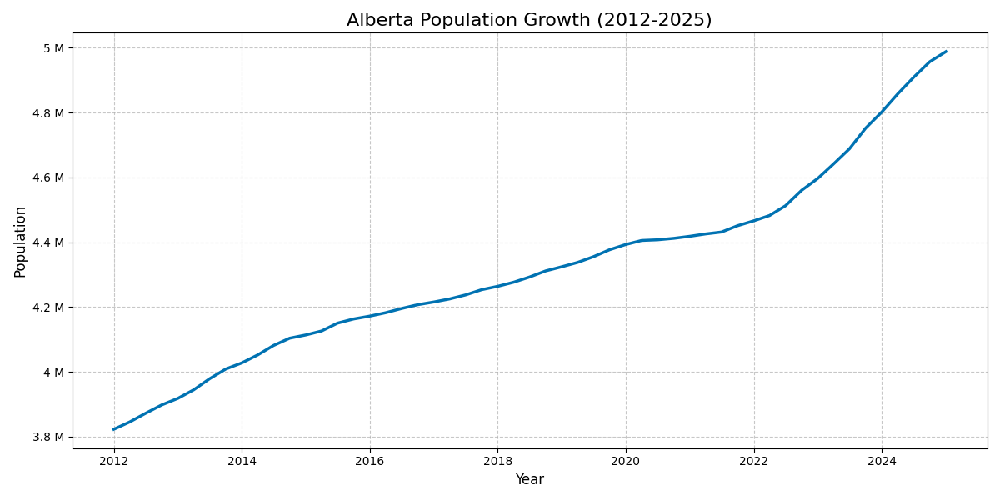
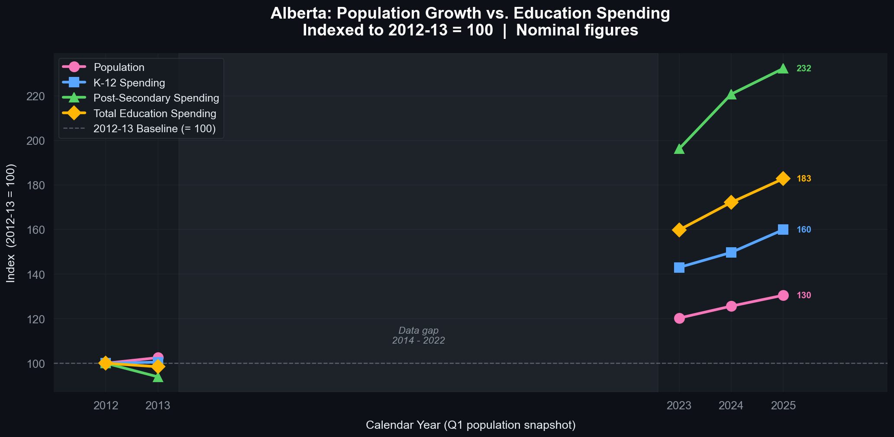
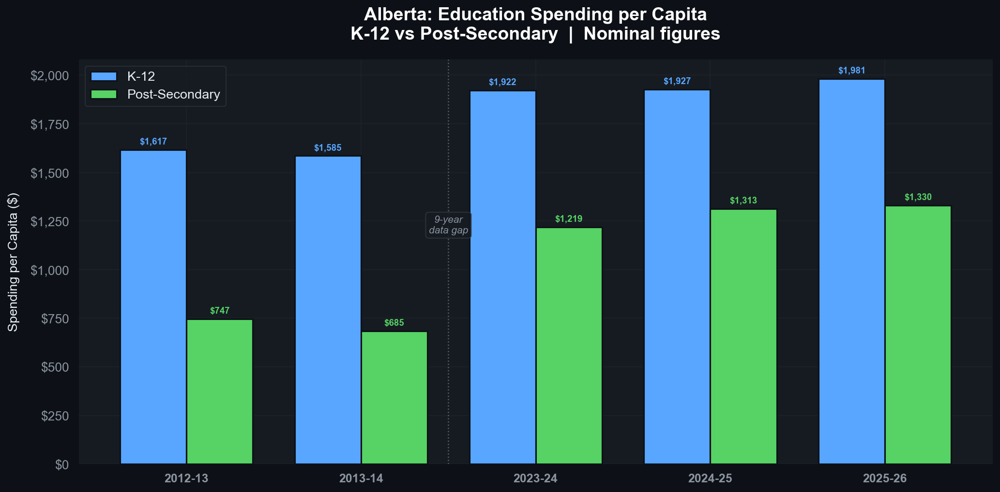
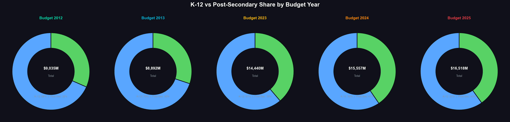

# Alberta Population & Education Spending Analysis (2012–2025)

A multi-part data science project examining Alberta's population growth and whether provincial education spending has kept pace with it. Built using open data from Statistics Canada and Alberta's published Budget Fiscal Plans.

---

## Project Structure

| Notebook | Description |
|---|---|
| [`Population Predictions Canada 2025.ipynb`](Population%20Predictions%20Canada%202025.ipynb) | Population trends analysis — growth rates, COVID impact, Alberta's share of Canada |
| [`Alberta Education Spending Comparison.ipynb`](Alberta%20Education%20Spending%20Comparison.ipynb) | Education spending across budget years (2012, 2013, 2023, 2024, 2025) — K-12 vs post-secondary |
| [`Alberta Population vs Education Spending.ipynb`](Alberta%20Population%20vs%20Education%20Spending.ipynb) | Integration analysis — did education spending grow proportionally to population? |

---

## Data Sources

| File | Description |
|---|---|
| [`17100009.csv`](17100009.csv) | Statistics Canada, Table 17-10-0009-01 — quarterly population estimates for all provinces, 1946–present |
| [`budget_data/`](budget_data/) | Alberta Budget Fiscal Plans — expense tables (Excel) for 2023-24, 2024-25, 2025-26; PDF fiscal plans for 2012-13, 2013-14 |
| [`budget_data/population_vs_spending.csv`](budget_data/population_vs_spending.csv) | Exported integrated dataset (population + spending + per-capita + indexed values) |

---

## Part 1: Population Analysis

**Notebook**: `Population Predictions Canada 2025.ipynb`

### Key Findings

| Metric | Value |
|---|---|
| Alberta Population (Q1 2012) | **3,822,425** |
| Alberta Population (Q1 2025) | **4,988,181** |
| Total Growth (2012–2025) | **+1,165,756 (~30.5%)** |
| Avg. Quarterly Growth Rate | **0.514%** |
| Peak Quarterly Growth Rate | **1.356%** *(Q4 2023)* |
| Lowest Quarterly Growth Rate | **0.046%** *(Q3 2020 — COVID-19 impact)* |
| Alberta's National Share (1951) | **6.7%** |
| Alberta's National Share (2025) | **12.1%** |
| National Share Change | **+5.4 percentage points** |

Alberta's population grew steadily over 13 years, accelerating sharply after 2020. The province added over **1.1 million people** — a ~30% increase. The most dramatic growth occurred in 2023, with quarterly rates exceeding 1%, more than double the long-term average. COVID-19 nearly halted growth in 2020, with Q3 2020 recording just 0.046%.

### Visualizations

**1. Alberta Population Growth (2012–2025)**
Line chart showing consistent upward growth with visible acceleration from 2022 onward.

---

**2. Quarterly Population Growth Rate**
Bar chart of quarter-over-quarter % change. Green = high growth (≥1%), blue = moderate, red = negative. Orange dashed line = long-run average (~0.51%).

---

**3. Alberta's Share of Canada's Total Population**
Line chart from 1951 to present. Alberta's share rose from 6.7% to 12.1%.

---

**4. Year-over-Year Growth Analysis**
Two-panel chart using Q1 (January) data: absolute YoY change (top) and YoY growth rate (bottom). Smooths quarterly noise to reveal long-run trends.

---

## Part 2: Education Spending Comparison

**Notebook**: `Alberta Education Spending Comparison.ipynb`

Compares K-12 and post-secondary operating expenses across five budget years using data extracted from Alberta Budget Fiscal Plans.

**Coverage**: Fiscal years 2012-13, 2013-14, 2023-24, 2024-25, 2025-26. All figures are nominal operating expenses in millions of CAD.

### Key Findings

| Budget Year | Fiscal Year | K-12 ($M) | Post-Secondary ($M) | Total ($M) |
|---|---|---|---|---|
| Budget 2012 | 2012-13 | 6,179 | 2,856 | 9,035 |
| Budget 2013 | 2013-14 | 6,210 | 2,682 | 8,892 |
| Budget 2023 | 2023-24 | 8,836 | 5,604 | 14,440 |
| Budget 2024 | 2024-25 | 9,252 | 6,305 | 15,557 |
| Budget 2025 | 2025-26 | 9,883 | 6,635 | 16,518 |

From 2012-13 to 2025-26 (nominal): K-12 +59.9%, Post-Secondary +132.3%, Total +82.8%.

### Visualizations

**1. K-12 vs Post-Secondary (Side-by-Side Bar)**
Grouped bar chart comparing the two spending streams across all five budget years.

---

**2. Total Education Spending (Stacked Horizontal Bar)**
Stacked bars showing the K-12 + post-secondary composition of total education spend per budget.

---

**3. Growth Waterfall: 2012 vs 2025**
Side-by-side bars for K-12, post-secondary, and total — annotated with percentage growth.

---

**4. Donut Charts — Budget Composition**
Five donut charts showing the K-12 / post-secondary split for each budget year.

---

**5. Heatmap — All Budget Years × Categories**
Colour-intensity matrix showing spending levels across budget years and categories.

---

**6. Lollipop Chart — Growth % by Category**
Horizontal lollipop chart showing percentage growth from 2012 to 2025 for K-12, post-secondary, and total education.

---

## Part 3: Population vs. Education Spending Integration

**Notebook**: `Alberta Population vs Education Spending.ipynb`

The core research question: **did Alberta's education spending grow proportionally to its rising population?**

Population figures are aligned to Q1 (January) of each fiscal year's starting calendar year. All spending figures are nominal (not inflation-adjusted).

### Key Findings

| Metric | 2012-13 / Q1 2012 | 2025-26 / Q1 2025 | Nominal Growth |
|---|---|---|---|
| Alberta Population | 3,822,425 | 4,988,181 | **+30.5%** |
| K-12 Operating Expense | $6,179M | $9,883M | **+59.9%** |
| Post-Secondary Operating Expense | $2,856M | $6,635M | **+132.3%** |
| Total Education Expense | $9,035M | $16,518M | **+82.8%** |
| Education Spending per Capita | ~$2,363 | ~$3,312 | **+40.1%** |

Education spending grew substantially faster than population in nominal terms. Total education spending increased 82.8% while the population grew 30.5% — spending grew at nearly 2.7× the rate of population. Per-capita education spending rose ~40%.

**Caveat**: Figures are nominal. A portion of the spending increase reflects inflation rather than real gains in educational capacity.

### Visualizations

**1. Indexed Growth (Headline Chart)**
All metrics normalized to 2012-13 = 100. Shows the divergence between population growth and spending growth over time. The data gap (2014–2022) is shaded and labelled.

---

**2. Per-Capita Education Spending**
K-12 and post-secondary spending per Albertan at each budget data point. Annotated with the 9-year data gap between 2013-14 and 2023-24.

---

**3. Growth Rates Lollipop**
Horizontal lollipop showing total % growth from the 2012-13 baseline for each metric. The population growth rate is drawn as a vertical reference line to make the divergence immediately visible.

---

---

## Key Findings & Visual Analysis

This section synthesizes all findings across the three parts of the project into a single narrative, walking through each infographic in sequence to tell the full story of Alberta's education spending and its relationship to population growth.

---

### 1. The Headline: Education Spending Grew 83% in 13 Years

Alberta's combined K-12 and post-secondary operating expense rose from **$9,035M in 2012-13 to $16,518M in 2025-26** — an **83% nominal increase** over 13 years. The stacked horizontal bar chart below makes the scale of each budget year immediately legible and shows how both funding streams have grown in tandem:

The critical observation here is the **step-change between 2013 and 2023**. Spending was nearly flat between the two early budgets ($9,035M → $8,892M), then surged to $14,440M by Budget 2023 — a 62% jump between the two sampled periods. Note that this dataset does not contain the intervening years (2014–2022), so the chart cannot show *when* within that decade the increase occurred, only that it did.

---

### 2. K-12 vs Post-Secondary: Two Very Different Growth Rates

While both sectors grew, the pace of growth is not equal. The grouped bar chart below places each funding stream side by side across all five budget years:

Post-secondary spending in 2012 ($2,856M) was less than half of K-12 ($6,179M). By 2025, that gap has narrowed considerably: post-secondary reached $6,635M while K-12 reached $9,883M. Post-secondary effectively grew its share of the education budget from ~32% to ~40% over this period. This suggests a structural shift in how Alberta allocates education dollars — not just a uniform scale-up.

---

### 3. The 13-Year Growth Gap at a Glance

The side-by-side comparison chart below distills the entire story of the 2012→2025 period into a single, annotated figure for each spending category:

| Category | 2012-13 | 2025-26 | Change |
|---|---|---|---|
| K-12 | $6,179M | $9,883M | **+60%** |
| Post-Secondary | $2,856M | $6,635M | **+132%** |
| Total Education | $9,035M | $16,518M | **+83%** |

Post-secondary more than doubled. K-12 grew by 60%. The total grew at 83% — a figure that sits between the two sector rates, weighted by their relative sizes.

---

### 4. How Budget Composition Shifted Over Time

The five donut charts below show the K-12 / post-secondary funding split at each budget year in a format that makes proportional changes easy to see:

In 2012 and 2013, post-secondary represented roughly **31–32%** of total education spending. By 2023–2025, that share climbed to **38–40%**. This reflects a sustained policy direction of increasing investment in colleges and universities at a faster rate than the K-12 system — even as K-12 spending grew significantly in absolute terms.

---

### 5. Spending Levels Compared Across All Dimensions — Heatmap

The heatmap encodes spending magnitude as colour intensity, allowing quick at-a-glance comparison across all budget years and categories simultaneously:

The dark red cells in the Total column for Budget 2024 and Budget 2025 highlight that combined education spending has entered a distinctly higher spending regime than the early 2010s. Post-secondary cells transition from pale yellow (2012–2013) to a warm orange (2023–2025), visually capturing the more than doubling of that funding stream. K-12 shows a more moderate shift from yellow-orange to orange, reflecting its slower but still substantial growth.

---

### 6. Growth Rate Comparison — Lollipop Chart

To present the core percentage growth figures as cleanly as possible, the lollipop chart below strips away all absolute values and focuses entirely on the rate of change from the 2012-13 baseline:

The visual hierarchy is intentional: post-secondary's **+132%** lollipop extends the furthest right, immediately signalling it as the outlier. Total education at **+83%** and K-12 at **+60%** provide the context. Together, every category substantially outpaced general economic growth benchmarks typically associated with a 13-year period.

---

### 7. The Core Question: Did Spending Keep Pace With Population?

Alberta's population grew from 3,822,425 in Q1 2012 to 4,988,181 in Q1 2025 — a **+30.5% increase**. The chart below places that population growth rate as a vertical reference line and overlays the spending growth rates for each education category:

The answer is unambiguous: **education spending outpaced population growth by a wide margin in every category**. Even K-12 (+59.9%) grew at nearly twice the population growth rate (+30.5%). Total education spending (+82.8%) grew at **2.7×** the rate of population. Post-secondary (+132.3%) grew at **4.3×** the rate of population. In nominal terms, Alberta substantially increased its per-person education investment — though inflation accounts for some portion of this gain.

---

### 8. Per-Capita Education Spending

The per-capita chart translates raw spending dollars into what the province spends per Albertan, normalizing for population growth to show the real change in resource allocation:

Key observations:
- **K-12 per capita** rose from **$1,617** (2012-13) to **$1,981** (2025-26) — a **+22.5% increase**, meaning meaningful real-terms investment growth even after accounting for the larger population base.
- **Post-secondary per capita** nearly doubled: from **$747** (2012-13) to **$1,330** (2025-26) — a **+78.0% increase**.
- Between 2012-13 and 2013-14, both metrics *fell* slightly — the only period in the dataset where per-capita spending declined — before the 9-year data gap.
- The dashed vertical line marks the **9-year gap** in available data (2014–2022), a structural limitation of the dataset that prevents tracking intermediate-year dynamics.

> **Important caveat**: All figures are **nominal** (not inflation-adjusted). Canada's CPI rose approximately 35–40% between 2012 and 2025. Real per-capita gains in education spending, while still positive, are more modest than the nominal figures suggest. This is especially relevant for K-12, where the nominal per-capita gain of ~22.5% likely represents a near-flat or slight real-terms decline when adjusted for inflation.

---

### Summary of Findings

| Finding | Detail |
|---|---|
| Total spending increase (2012–2025) | **+$7,483M (+83%)** nominal |
| Fastest-growing sector | Post-Secondary at **+132%** |
| Population growth over same period | **+30.5%** — far below spending growth |
| Per-capita K-12 change | **$1,617 → $1,981 (+22.5%)** |
| Per-capita Post-Secondary change | **$747 → $1,330 (+78.0%)** |
| Post-secondary budget share | Grew from **~32%** to **~40%** of total education |
| Inflation caveat | Nominal figures; CPI rose ~35–40% over the same period |

Alberta clearly chose to grow its education budget substantially faster than its population — particularly in post-secondary. Whether this represents a genuine increase in educational capacity, catch-up from underfunding in the intervening years, or a response to demographic shifts in the student-age population cannot be determined from spending data alone.

---

## Methodology

1. **Population data**: Statistics Canada Table 17-10-0009-01 loaded into pandas and filtered for Alberta. Q1 (January) snapshots used for annual comparisons.
2. **Spending data**: Operating expense figures extracted from Alberta Budget Fiscal Plans (PDF and Excel). One headline estimate row retained per budget year.
3. **Fiscal year alignment**: Each fiscal year (e.g., 2012-13) is aligned to the Q1 population of its starting calendar year (e.g., January 2012).
4. **Derived metrics**:
   - `Per_Capita` = spending in dollars / population
   - `Index` = (current value / 2012-13 baseline value) × 100
   - `Growth_Pct` = (latest / baseline − 1) × 100
5. **Visualization**: All charts use a dark infographic theme (`#0D1117` background) with `matplotlib` and `seaborn`.

## Tools & Libraries

- **Python 3.12**
- **pandas** — data manipulation
- **numpy** — numerical operations
- **seaborn** / **matplotlib** — visualization

---

*Population data: Statistics Canada, Table 17-10-0009-01.*
*Spending data: Alberta Budget Fiscal Plans (Government of Alberta).*
