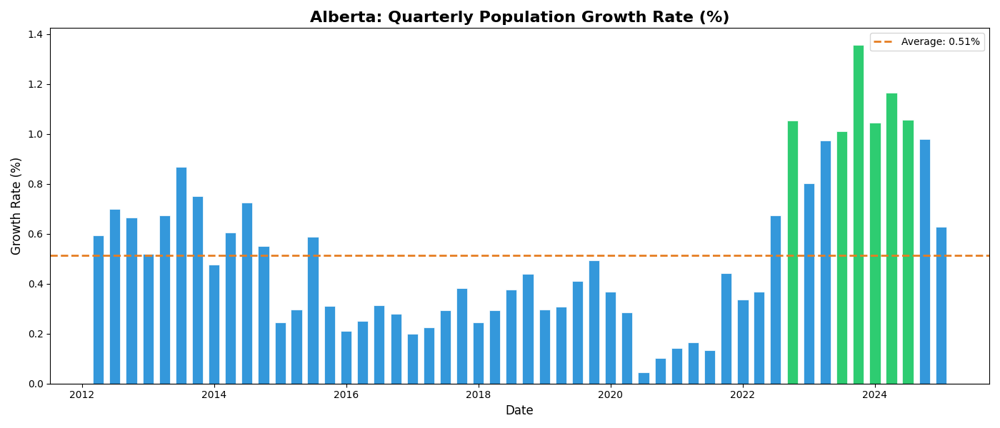
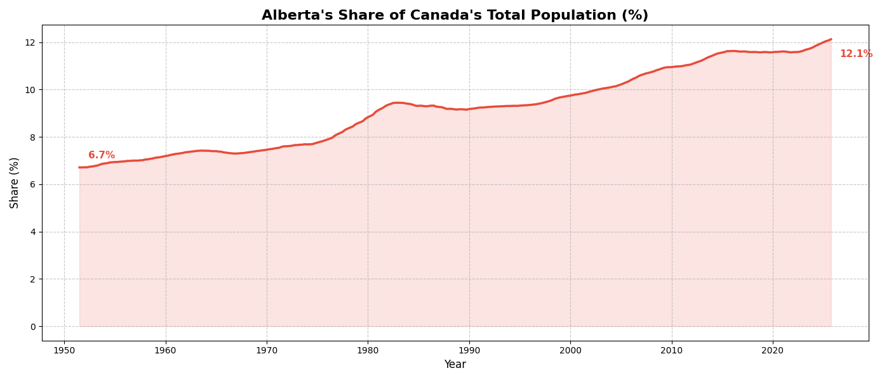
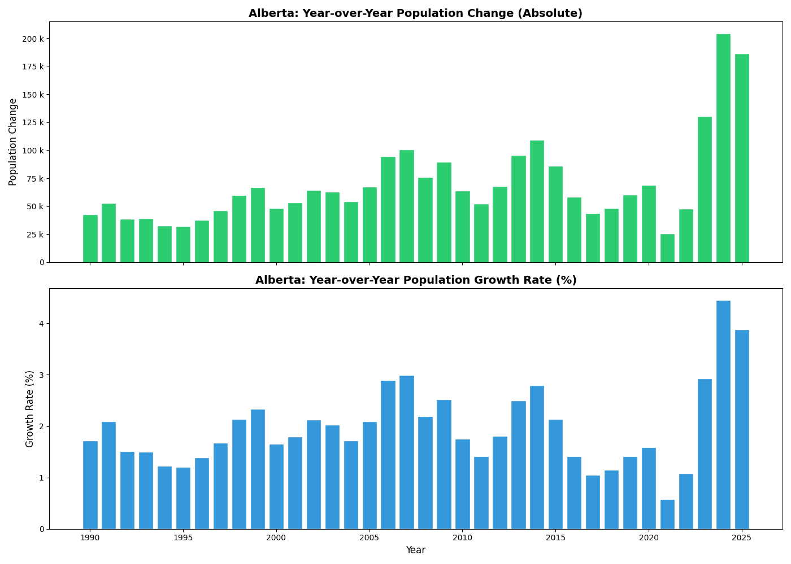
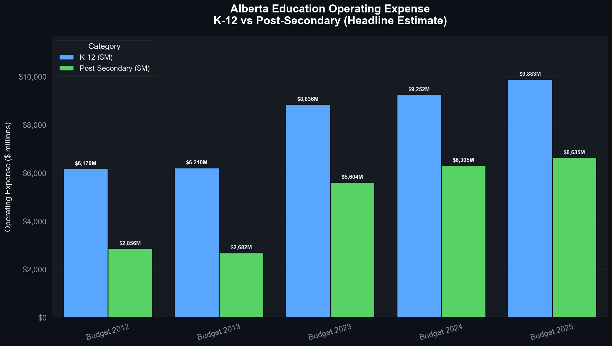
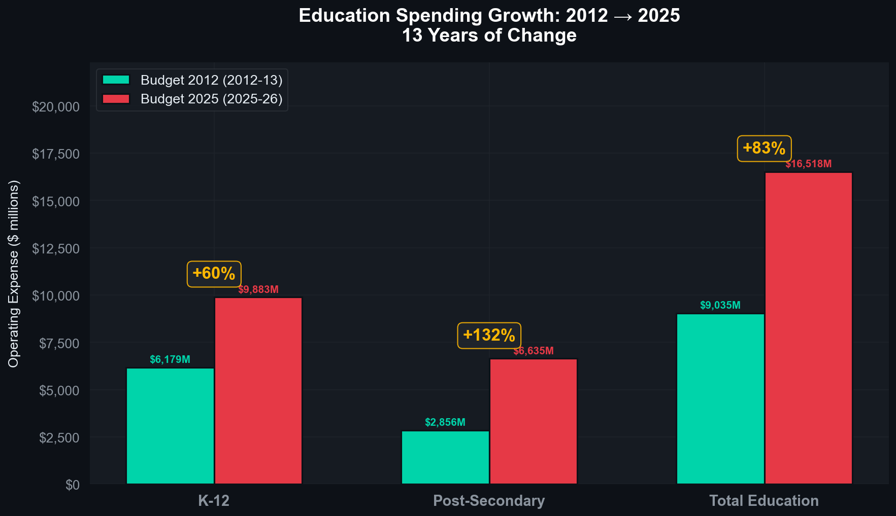

# Alberta Population & Education Spending Analysis (2012–2025)

A multi-part data science project examining Alberta's dramatic population growth and whether provincial education spending kept pace. Built using open data from Statistics Canada and Alberta's published Budget Fiscal Plans.

---

## The Story in Three Numbers

> **+30.5%** — Alberta's population growth from 2012 to 2025
> **+82.8%** — Total education spending growth over the same period
> **2.7×** — How much faster spending grew relative to population

Alberta didn't just grow -- its population exploded!  Over thirteen years, the province added more than **1.1 million people**, saw its share of Canada's national population nearly double, and simultaneously made a bet on education spending that far outpaced the pace of that growth. The charts below tell that story in full.

---

## Part 1: Alberta's Population Surge

**Notebook**: [`Population Predictions Canada 2025.ipynb`](Population%20Predictions%20Canada%202025.ipynb)

Alberta's population growth between 2012 and 2025 was not a slow, steady climb — it was an acceleration. The province began the period at 3.8 million people and ended it approaching 5 million, with the most dramatic gains concentrated in the post-pandemic years of 2022–2023.

### Key Metrics

| Metric | Value |
|---|---|
| Alberta Population (Q1 2012) | **3,822,425** |
| Alberta Population (Q1 2025) | **4,988,181** |
| Total Growth | **+1,165,756 people (+30.5%)** |
| Avg. Quarterly Growth Rate | **0.514%** |
| Peak Quarterly Growth Rate | **1.356%** *(Q4 2023 — more than 2× the long-run average)* |
| Lowest Quarterly Growth Rate | **0.046%** *(Q3 2020 — COVID-19)* |
| Alberta's National Share (1951) | **6.7%** |
| Alberta's National Share (Q1 2025) | **12.1%** |

---

### Chart 1 — The Growth Curve

The headline chart: Alberta's population from 2012 to 2025. The upward slope is consistent throughout but visibly steepens from 2022 onward, marking the province's post-pandemic migration surge.

Between 2012 and 2019, the province grew at a moderate, relatively stable pace. COVID-19 nearly stalled that in 2020. Then, from 2021 onward, Alberta became one of the fastest-growing provinces in Canada as interprovincial and international migrants moved in at rates not seen in decades.

---

### Chart 2 — Quarter-by-Quarter Growth Rate

The bar chart below breaks the population series into individual quarters, colour-coded by intensity. Green bars represent high-growth quarters (≥1%); blue bars moderate growth; red bars near-zero or negative quarters. The orange dashed line marks the long-run average of ~0.51%.

The COVID-19 effect is stark: Q3 2020 registered just **+0.046%**, the lowest in the dataset. The rebound was equally dramatic — by Q4 2023, the quarterly growth rate hit **+1.356%**, more than double the historical average. The cluster of green bars in 2022–2023 represents an extraordinary period of population absorption.

---

### Chart 3 — Alberta's Rising National Share

Alberta's demographic weight within Canada has been growing for decades. The chart below tracks that share from 1951 to the present.

In 1951, Alberta held 6.7% of Canada's population. By Q1 2025, it held **12.1%** — nearly double that share. This trajectory reflects long-term structural shifts: the oil and gas economy of the 1970s–80s, and more recently, Alberta's relatively affordable cost of living compared to Ontario and British Columbia, which pulled significant interprovincial migration.

---

### Chart 4 — Year-over-Year Analysis

This two-panel chart uses Q1 (January) snapshots to smooth out seasonal noise and show the long-run trend: absolute annual population additions (top panel) and the annual growth rate (bottom panel).

The top panel shows that the province was adding roughly **60,000–80,000 people per year** through the 2010s — large numbers in absolute terms, but modest as a share of the base. From 2021 to 2023, that figure surged past **100,000+ per year**, peaking at a rate the province had not seen since the 2006–2008 commodity boom. The bottom panel shows the rate normalising slightly in 2024–2025 but remaining well above the pre-pandemic baseline.

---

## Part 2: The Education Spending Trajectory

**Notebook**: [`Alberta Education Spending Comparison.ipynb`](Alberta%20Education%20Spending%20Comparison.ipynb)

As the population expanded, so did the province's education budget — but far faster than raw headcount would suggest. Alberta's combined K-12 and post-secondary operating expenditure grew from **$9.0 billion in 2012-13** to **$16.5 billion in 2025-26**: an **83% nominal increase** over 13 years.

The spending data is drawn from five Alberta Budget Fiscal Plans across two distinct eras — the early 2010s (Budget 2012 and 2013) and the 2020s (Budget 2023, 2024, 2025). All figures are nominal operating expenses in millions of CAD.

### Spending by Budget Year

| Budget Year | Fiscal Year | K-12 ($M) | Post-Secondary ($M) | Total ($M) |
|---|---|---|---|---|
| Budget 2012 | 2012-13 | 6,179 | 2,856 | 9,035 |
| Budget 2013 | 2013-14 | 6,210 | 2,682 | 8,892 |
| Budget 2023 | 2023-24 | 8,836 | 5,604 | 14,440 |
| Budget 2024 | 2024-25 | 9,252 | 6,305 | 15,557 |
| Budget 2025 | 2025-26 | 9,883 | 6,635 | 16,518 |

From 2012-13 to 2025-26 (nominal): K-12 **+59.9%**, Post-Secondary **+132.3%**, Total **+82.8%**.

---

### Chart 5 — Total Spending, Year by Year (Stacked Bar)

The stacked horizontal bar chart shows the combined K-12 and post-secondary spend at each of the five budget years. Each bar is split by sector, making the composition visible at a glance.

The most striking feature is the **step-change between 2013 and 2023**. Total spending barely moved between the two early budgets ($9,035M → $8,892M). Then it surged to $14,440M in Budget 2023 — a **62% jump** between the two sampled eras. The dataset does not cover the intervening decade (2014–2022), so the chart cannot pinpoint *when* within those years the increase occurred; only that it did, substantially.

---

### Chart 6 — K-12 vs Post-Secondary Side-by-Side

The grouped bar chart below separates the two funding streams and places them next to each other for every budget year.

In 2012, post-secondary at $2,856M was less than half of K-12 at $6,179M. By 2025, that gap had narrowed considerably: post-secondary reached $6,635M while K-12 reached $9,883M. Post-secondary spending more than doubled. K-12 grew by 60%. These are two very different growth stories running in parallel — both up, but at strikingly different rates.

---

### Chart 7 — The 13-Year Gap at a Glance

This side-by-side comparison chart distills the full 2012→2025 arc into a single annotated figure for each category, making the before-and-after comparison as direct as possible.

| Category | 2012-13 | 2025-26 | Change |
|---|---|---|---|
| K-12 | $6,179M | $9,883M | **+60%** |
| Post-Secondary | $2,856M | $6,635M | **+132%** |
| Total Education | $9,035M | $16,518M | **+83%** |

Post-secondary more than doubled in nominal terms. Total education spending grew 83% — a figure that sits between the two sector rates, weighted by their relative sizes.

---

### Chart 8 — Budget Composition Over Time (Donut Charts)

The five donut charts show the K-12 / post-secondary split at each budget year, making proportional shifts visible even when absolute values differ.

In 2012 and 2013, post-secondary represented roughly **31–32%** of total education spending. By 2023–2025 that share had climbed to **38–40%**. This reflects a clear policy direction: Alberta has been directing a growing proportion of its education dollars toward colleges and universities, even as K-12 spending continued to rise in absolute terms. The education budget did not simply scale up uniformly — its internal composition shifted.

---

### Chart 9 — Spending Intensity Heatmap

The heatmap encodes spending magnitude as colour intensity, allowing simultaneous comparison across all budget years and categories in a single view.

The dark red cells in the Total column for Budget 2024 and Budget 2025 confirm that combined education spending has entered a distinctly higher regime than the early 2010s. Post-secondary cells transition from pale yellow (2012–2013) to warm orange (2023–2025), visually capturing the more than doubling of that funding stream. K-12 shows a more moderate shift — yellow-orange to orange — consistent with its slower but still substantial growth.

---

### Chart 10 — Growth Rate Lollipop

The lollipop chart strips away absolute values entirely and focuses on the percentage growth from the 2012-13 baseline for each category, making it the most direct single-chart answer to "how much did each sector grow?"

The visual hierarchy is immediate: post-secondary's **+132%** lollipop extends furthest right. Total education at **+83%** and K-12 at **+60%** provide the context. All three substantially outpaced what one would expect from a general 13-year economic growth baseline.

---

## Part 3: Did Spending Keep Pace with Population?

**Notebook**: [`Alberta Population vs Education Spending.ipynb`](Alberta%20Population%20vs%20Education%20Spending.ipynb)

The core research question of the project: **Alberta's population grew 30.5% — did education spending grow proportionally?** The answer, in short, is no — spending grew much faster.

| Metric | 2012-13 / Q1 2012 | 2025-26 / Q1 2025 | Nominal Growth |
|---|---|---|---|
| Alberta Population | 3,822,425 | 4,988,181 | **+30.5%** |
| K-12 Operating Expense | $6,179M | $9,883M | **+59.9%** |
| Post-Secondary Operating Expense | $2,856M | $6,635M | **+132.3%** |
| Total Education Expense | $9,035M | $16,518M | **+82.8%** |
| Education Spending per Capita | ~$2,363 | ~$3,312 | **+40.1%** |

Every spending category grew at least twice as fast as the population. Total education spending grew at **2.7× the rate of population**. Post-secondary grew at **4.3×** the rate.

---

### Chart 11 — Growth Rates vs Population Benchmark

The lollipop chart below places the population growth rate (+30.5%) as a vertical reference line and overlays the spending growth rates for each education category. This is the single chart that most directly answers the central research question.

Every bar extends well beyond the population reference line. K-12 spending grew at nearly **2×** the population rate. Total education grew at **2.7×**. Post-secondary grew at **4.3×**. In nominal terms, Alberta substantially increased its per-person education investment — though inflation accounts for part of this gain (Canada's CPI rose approximately 35–40% between 2012 and 2025).

---

### Chart 12 — Indexed Growth: All Metrics on a Common Scale

The indexed chart normalises all metrics to 2012-13 = 100, placing population and all three spending categories on the same axis so their relative trajectories can be directly compared.

The divergence is visually compelling. Population's index line rises to ~130 by 2025. Total education reaches ~183. Post-secondary reaches ~232. All three spending lines leave the population line behind — and they do so sharply after 2013, even accounting for the data gap covering 2014–2022 (shaded region). This is not a marginal difference; it is a structural gap between the pace of population growth and the pace of fiscal commitment to education.

---

### Chart 13 — Per-Capita Education Spending

Translating raw spending into per-capita figures removes the population growth factor entirely, leaving only the change in how much Alberta invests per person in education.

Key observations:
- **K-12 per capita** rose from **$1,617** (2012-13) to **$1,981** (2025-26) — a **+22.5% nominal increase**. After adjusting for inflation (~35–40% CPI growth), this likely represents a **near-flat or slight real-terms decline**, meaning K-12 investment per student held roughly steady in purchasing-power terms.
- **Post-secondary per capita** rose from **$747** to **$1,330** — a **+78.0% nominal increase**. Even after inflation, this represents a meaningful real increase in per-person post-secondary investment.
- Between 2012-13 and 2013-14, both metrics *fell slightly* — the only period in the dataset where per-capita spending declined before the 9-year data gap.

> **Important caveat**: All figures throughout this project are **nominal** (not inflation-adjusted). With Canadian CPI rising approximately 35–40% from 2012 to 2025, real gains in education spending — while still positive — are more modest than the nominal figures suggest. This is particularly relevant for K-12, where the nominal +22.5% per-capita gain likely represents flat or marginally negative real-terms growth.

---

## Summary of Findings

| Finding | Detail |
|---|---|
| Alberta Population (2012 → 2025) | 3.8M → 5.0M — **+30.5% (+1.1M people)** |
| Post-pandemic surge | Quarterly growth hit **1.36%** in Q4 2023 — more than **2× the long-run average** |
| Alberta's share of Canada | Rose from 6.7% (1951) to **12.1%** (2025) |
| Total education spending (2012 → 2025) | $9.0B → $16.5B — **+$7.5B (+83% nominal)** |
| Fastest-growing sector | Post-Secondary at **+132%** |
| Slowest-growing sector | K-12 at **+60%** — still twice the population growth rate |
| Post-secondary budget share | Grew from **~32%** to **~40%** of total education |
| Per-capita K-12 change | **$1,617 → $1,981 (+22.5%)** — likely flat in real terms |
| Per-capita Post-Secondary change | **$747 → $1,330 (+78.0%)** — positive in real terms even after inflation |
| Spending vs population (total) | Education spending grew at **2.7× the rate of population growth** |
| Inflation caveat | Nominal figures; CPI rose ~35–40% over the same period |

Alberta clearly chose to grow its education budget substantially faster than its population — particularly in post-secondary. Whether this represents a genuine increase in educational capacity, catch-up from a decade of underfunding in the intervening years, or a structural response to demographic shifts in the student-age population cannot be determined from spending data alone. The data establishes the *scale* of the investment; the interpretation of its adequacy is a separate question.

---

## Project Structure

| Notebook | Description |
|---|---|
| [`Population Predictions Canada 2025.ipynb`](Population%20Predictions%20Canada%202025.ipynb) | Population trends — growth rates, COVID impact, Alberta's national share |
| [`Alberta Education Spending Comparison.ipynb`](Alberta%20Education%20Spending%20Comparison.ipynb) | Education spending by budget year — K-12 vs post-secondary |
| [`Alberta Population vs Education Spending.ipynb`](Alberta%20Population%20vs%20Education%20Spending.ipynb) | Integration — did spending grow proportionally to population? |

## Data Sources

| File | Description |
|---|---|
| [`17100009.csv`](17100009.csv) | Statistics Canada, Table 17-10-0009-01 — quarterly population estimates, 1946–present |
| [`budget_data/`](budget_data/) | Alberta Budget Fiscal Plans — expense tables (Excel) for 2023-24, 2024-25, 2025-26; PDF fiscal plans for 2012-13, 2013-14 |
| [`budget_data/population_vs_spending.csv`](budget_data/population_vs_spending.csv) | Integrated dataset — population + spending + per-capita + indexed values |

## Methodology

1. **Population data**: Statistics Canada Table 17-10-0009-01 loaded into pandas, filtered for Alberta. Q1 (January) snapshots used for annual comparisons.
2. **Spending data**: Operating expense figures extracted from Alberta Budget Fiscal Plans (PDF and Excel). One headline estimate row retained per budget year.
3. **Fiscal year alignment**: Each fiscal year (e.g., 2012-13) is aligned to the Q1 population of its starting calendar year (e.g., January 2012).
4. **Derived metrics**:
   - `Per_Capita` = spending in dollars / population
   - `Index` = (current value / 2012-13 baseline value) × 100
   - `Growth_Pct` = (latest / baseline − 1) × 100
5. **Visualization**: Dark infographic theme (`#0D1117` background) throughout, using `matplotlib` and `seaborn`.

## Tools & Libraries

- **Python 3.12**
- **pandas** — data manipulation
- **numpy** — numerical operations
- **seaborn** / **matplotlib** — visualization

---

*Population data: Statistics Canada, Table 17-10-0009-01.*
*Spending data: Alberta Budget Fiscal Plans (Government of Alberta).*

